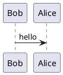

这是一篇专门用于测试博客渲染能力的示例文章，目标是一次性覆盖常见 Markdown 组件、DoIt 扩展组件以及长代码块的折叠与高亮效果。

<!--more-->


这篇文章会同时覆盖段落、标题、强调、列表、任务列表、引用、表格、定义列表、脚注、图片、HTML 细节折叠、Mermaid、KaTeX，以及多语言语法高亮代码块。


## 基础排版

这是普通段落文本。你可以在这里看到 **粗体**、*斜体*、~~删除线~~、`行内代码`、以及一个普通链接 [Hugo](https://gohugo.io/)。

同一段里也可以测试转义字符，例如 `\*not italic\*`、`\<div\>`、以及路径 `/posts/markdown-components-demo/` 的显示效果。

> 写博客不只是发布结论，更是在沉淀一套可复用的思考过程。
>
> 对技术站点来说，好的示例文章本身就是最直接的回归测试。

- 无序列表项一：验证基础项目符号。
- 无序列表项二：验证中英文混排。
- 无序列表项三：验证 `inline code` 出现在列表中的效果。

1. 有序列表项一：确认数字序号样式。
2. 有序列表项二：确认换行与缩进。
3. 有序列表项三：确认渲染与主题间距。

- [x] 任务列表项：Mermaid
- [x] 任务列表项：KaTeX
- [x] 任务列表项：Rust / Go / C++ 长代码块
- [ ] 任务列表项：未来继续补更多 shortcode 验收

---

## 表格与定义列表

| 组件 | 用途 | 本文是否覆盖 |
| :-- | :-- | :-- |
| Markdown 标题 | 测试目录与锚点 | 是 |
| Mermaid | 测试图表 shortcode | 是 |
| KaTeX | 测试公式渲染 | 是 |
| 长代码块 | 测试折叠、行号与高亮 | 是 |
| 图片 | 测试 Markdown 图片与灯箱 | 是 |


DoIt 主题的 goldmark definition list 渲染目前存在 bug

参考：[https://github.com/HEIGE-PCloud/DoIt/issues/1590](https://github.com/HEIGE-PCloud/DoIt/issues/1590)


OAuth 2.0
: 一种授权框架，用于在不暴露用户密码的前提下授予第三方应用受限访问能力。

PKCE
: Proof Key for Code Exchange，通常和 Authorization Code Flow 一起使用，用于降低授权码被截获后的风险。

Mermaid
: 一种用接近 Markdown 的文本语法描述流程图、时序图和其他图表的工具。

## 图片与脚注

下面这张图片使用普通 Markdown 图片语法，适合验证远程图片、标题和点击预览行为：


这是一段带脚注的文本，用于验证脚注锚点和回跳行为。OAuth 回调里最容易被忽略的校验通常是 `state` 与 PKCE 的 `code_verifier`。[^oauth-note]

## HTML 细节折叠

<details>
  <summary>展开查看额外说明</summary>
  <p>DoIt 当前配置里启用了 Goldmark 的 <code>unsafe = true</code>，因此类似 <code>details</code> 这样的原生 HTML 片段可以直接写在 Markdown 中。</p>
  <p>这对一些轻量交互内容很有帮助，比如 FAQ、可折叠的注意事项和调试备注。</p>
</details>

## Mermaid

时序图

sequenceDiagram
    autonumber
    actor U as User Browser
    participant F as Frontend
    participant B as Blog Backend
    participant G as Google OAuth
    participant API as Google APIs

    U->>F: Click "Continue with Google"
    F->>B: GET /oauth/google/login
    B->>G: 302 Authorization Request\nclient_id + scope + state + PKCE
    G-->>U: Render consent page
    U->>G: Sign in and approve scopes
    G-->>B: 302 /oauth/google/callback?code=...&state=...
    B->>B: Validate state and code_verifier
    B->>G: POST /token with authorization code
    G-->>B: access_token + id_token + refresh_token
    B->>API: GET /userinfo with access_token
    API-->>B: profile payload
    B->>B: Upsert user and create session
    B-->>F: Set-Cookie + redirect /
    F->>B: GET /api/me with session cookie
    B-->>F: Current user profile
    F-->>U: Render signed-in state


甘特图

gantt
    dateFormat  YYYY-MM-DD
    title Adding GANTT diagram functionality to mermaid
    section A section
    Completed task            :done,    des1, 2014-01-06,2014-01-08
    Active task               :active,  des2, 2014-01-09, 3d
    Future task               :         des3, after des2, 5d
    Future task2               :         des4, after des3, 5d
    section Critical tasks
    Completed task in the critical line :crit, done, 2014-01-06,24h
    Implement parser and jison          :crit, done, after des1, 2d
    Create tests for parser             :crit, active, 3d
    Future task in critical line        :crit, 5d
    Create tests for renderer           :2d
    Add to mermaid                      :1d


类图

classDiagram
    Class01 <|-- AveryLongClass : Cool
    Class03 *-- Class04
    Class05 o-- Class06
    Class07 .. Class08
    Class09 --> C2 : Where am i?
    Class09 --* C3
    Class09 --|> Class07
    Class07 : equals()
    Class07 : Object[] elementData
    Class01 : size()
    Class01 : int chimp
    Class01 : int gorilla
    Class08 <--> C2: Cool label


Git 图


gitGraph
    commit
    branch hotfix
    checkout hotfix
    commit
    branch develop
    checkout develop
    commit id:"ash" tag:"abc"
    branch featureB
    checkout featureB
    commit type:HIGHLIGHT
    checkout main
    checkout hotfix
    commit type:NORMAL
    checkout develop
    commit type:REVERSE
    checkout featureB
    commit
    checkout main
    merge hotfix
    checkout featureB
    commit
    checkout develop
    branch featureA
    commit
    checkout develop
    merge hotfix
    checkout featureA
    commit
    checkout featureB
    commit
    checkout develop
    merge featureA
    branch release
    checkout release
    commit
    checkout main
    commit
    checkout release
    merge main
    checkout develop
    merge release


## echarts

DoIt 主题支持 JSON、YAML 及 TOML 格式的 echarts


{
  "title": {
    "text": "折线统计图",
    "top": "2%",
    "left": "center"
  },
  "tooltip": {
    "trigger": "axis"
  },
  "legend": {
    "data": ["邮件营销", "联盟广告", "视频广告", "直接访问", "搜索引擎"],
    "top": "10%"
  },
  "grid": {
    "left": "5%",
    "right": "5%",
    "bottom": "5%",
    "top": "20%",
    "containLabel": true
  },
  "toolbox": {
    "feature": {
      "saveAsImage": {
        "title": "保存为图片"
      }
    }
  },
  "xAxis": {
    "type": "category",
    "boundaryGap": false,
    "data": ["周一", "周二", "周三", "周四", "周五", "周六", "周日"]
  },
  "yAxis": {
    "type": "value"
  },
  "series": [
    {
      "name": "邮件营销",
      "type": "line",
      "stack": "总量",
      "data": [120, 132, 101, 134, 90, 230, 210]
    },
    {
      "name": "联盟广告",
      "type": "line",
      "stack": "总量",
      "data": [220, 182, 191, 234, 290, 330, 310]
    },
    {
      "name": "视频广告",
      "type": "line",
      "stack": "总量",
      "data": [150, 232, 201, 154, 190, 330, 410]
    },
    {
      "name": "直接访问",
      "type": "line",
      "stack": "总量",
      "data": [320, 332, 301, 334, 390, 330, 320]
    },
    {
      "name": "搜索引擎",
      "type": "line",
      "stack": "总量",
      "data": [820, 932, 901, 934, 1290, 1330, 1320]
    }
  ]
}


## KaTeX 公式

行内公式示例：访问令牌有效期可以近似记为 $T_{access} \approx 3600\ \text{s}$，而刷新令牌的生命周期通常远大于访问令牌。

块级公式示例：

$$
f(x) = \int_{-\infty}^\infty  \hat f(x)\xi\,e^{2 \pi i \xi x}  \,\mathrm{d}\xi 
$$

$$
\mathbf{V}_1 \times \mathbf{V}_2 =  
\begin{vmatrix}  
  \mathbf{i}& \mathbf{j}& \mathbf{k} \\  
  \frac{\partial X}{\partial u}& \frac{\partial Y}{\partial u}& 0 \\  
  \frac{\partial X}{\partial v}& \frac{\partial Y}{\partial v}& 0 \\  
\end{vmatrix} 
$$

$$
\ce{Zn^2+  <=>[+ 2OH-][+ 2H+]  $\underset{\text{amphoteres Hydroxid}}{\ce{Zn(OH)2 v}}$  <=>[+ 2OH-][+ 2H+]  $\underset{\text{Hydroxozikat}}{\ce{[Zn(OH)4]^2-}}$} 
$$


下面三段代码主要用于测试语法高亮、代码块标题、默认折叠、行号与长内容滚动。每段代码都刻意控制为 100 行，方便你直接肉眼确认。


## YouTube 播放器



## PlantUML



## WaveDrom

```wavedrom
{signal: [
  {name: 'clock',   wave: 'p................'},
  {name: 'hwrite',  wave: 'x0x.0x..0.x.0.x..'},
  {name: 'htrans',  wave: 'x3x.4x..5.x.6.x..', data: '2 2 2 2'},
  {name: 'haddr',   wave: 'x3x.4x..5.x.6.x..', data: 'A0 A1 A2 A3'},
  {},
  {name: 'hready',  wave: 'x1.x101x01.x0101x'},
  {name: 'hrdata',  wave: 'x.3x..4x..5x...6x', data: 'D0 D1 D2 D3'},
],
    head: {tock: 1},
    gaps: '( . . 1 . s . 1 s . . 1 s . s . )',
    foot: {text: 'reads'}
}
```

## Blockquotes

GitHub 风格的 blockquote

> [!NOTE]
> Useful information that users should know, even when skimming content.

> [!TIP]
> Helpful advice for doing things better or more easily.

> [!IMPORTANT]
> Key information users need to know to achieve their goal.

> [!WARNING]
> Urgent info that needs immediate user attention to avoid problems.

> [!CAUTION]
> Advises about risks or negative outcomes of certain actions.

## Style

{{< style "text-align:right; strong{color:#00b1ff;}" >}}
This is a **right-aligned** paragraph.


## Rust 代码块示例

```rust
use std::collections::{BTreeMap, HashMap};
const DEFAULT_TTL_SECS: u64 = 3600;
#[derive(Clone, Debug)]
struct User {
    id: u64,
    name: String,
    scopes: Vec<String>,
}
#[derive(Clone, Debug)]
struct TokenRecord {
    access_token: String,
    ttl_secs: u64,
    user: User,
}
struct TokenCache {
    store: HashMap<u64, TokenRecord>,
}
impl TokenCache {
    fn new() -> Self {
        Self { store: HashMap::new() }
    }
    fn put(&mut self, user: User, access_token: &str, scopes: &str) {
        let user_id = user.id;
        let scopes = parse_scopes(scopes);
        let record = TokenRecord {
            access_token: access_token.to_string(),
            ttl_secs: DEFAULT_TTL_SECS,
            user: User { scopes, ..user },
        };
        self.store.insert(user_id, record);
    }
    fn has_scope(&self, user_id: u64, scope: &str) -> bool {
        self.store.get(&user_id)
            .map(|record| record.user.scopes.iter().any(|value| value == scope))
            .unwrap_or(false)
    }
    fn names(&self) -> Vec<String> {
        let mut names = self.store.values().map(|record| record.user.name.clone()).collect::<Vec<_>>();
        names.sort();
        names
    }
}
fn parse_scopes(input: &str) -> Vec<String> {
    input.split(',').map(str::trim)
        .filter(|value| !value.is_empty())
        .map(ToString::to_string)
        .collect()
}
fn exchange_code(code: &str) -> Result<String, String> {
    if code.len() < 8 {
        return Err("authorization code is too short".into());
    }
    Ok(format!("token_{}", &code[..8]))
}
fn fetch_profile(token: &str) -> Result<User, String> {
    if !token.starts_with("token_") {
        return Err("invalid token format".into());
    }
    Ok(User {
        id: 42,
        name: "demo-user".into(),
        scopes: vec!["openid".into(), "email".into()],
    })
}
fn build_scope_index(cache: &TokenCache) -> BTreeMap<String, usize> {
    let mut stats = BTreeMap::new();
    for record in cache.store.values() {
        for scope in &record.user.scopes {
            *stats.entry(scope.clone()).or_insert(0) += 1;
        }
    }
    stats
}
fn seed_cache() -> TokenCache {
    let mut cache = TokenCache::new();
    cache.put(User { id: 1, name: "alice".into(), scopes: Vec::new() }, "token_alice", "openid,email,profile");
    cache.put(User { id: 2, name: "bob".into(), scopes: Vec::new() }, "token_bob__", "openid");
    cache.put(User { id: 3, name: "carol".into(), scopes: Vec::new() }, "token_carol", "openid,calendar");
    cache
}
fn main() -> Result<(), String> {
    let cache = seed_cache();
    println!("known users: {}", cache.names().join(", "));
    println!("carol has calendar: {}", cache.has_scope(3, "calendar"));
    println!("bob has drive: {}", cache.has_scope(2, "drive"));
    for (scope, count) in build_scope_index(&cache) {
        println!("{scope}: {count}");
    }
    let token = exchange_code("abcd1234xyz")?;
    let profile = fetch_profile(&token)?;
    println!("signed in: {}", profile.name);
    println!("granted scopes: {}", profile.scopes.join(", "));
    if let Some(record) = cache.store.get(&1) {
        println!("alice token preview: {}", &record.access_token[..10]);
    }
    if let Some(record) = cache.store.get(&1) {
        println!("alice ttl: {}", record.ttl_secs);
    }
    Ok(())
}
```

## Go 代码块示例

```go
package main
import (
	"context"
	"encoding/json"
	"fmt"
	"log"
	"net/http"
	"sync"
	"time"
)
type Session struct {
	UserID      string    `json:"user_id"`
	AccessToken string    `json:"access_token"`
	ExpiresAt   time.Time `json:"expires_at"`
}
type Store struct {
	mu       sync.RWMutex
	sessions map[string]Session
}
func NewStore() *Store {
	return &Store{sessions: map[string]Session{}}
}
func (s *Store) Save(id string, session Session) {
	s.mu.Lock()
	defer s.mu.Unlock()
	s.sessions[id] = session
}
func (s *Store) Get(id string) (Session, bool) {
	s.mu.RLock()
	defer s.mu.RUnlock()
	session, ok := s.sessions[id]
	return session, ok
}
func exchangeCode(ctx context.Context, code string) (string, error) {
	_ = ctx
	if len(code) < 8 {
		return "", fmt.Errorf("authorization code is too short")
	}
	return "token_" + code[:8], nil
}

func fetchProfile(ctx context.Context, token string) (string, error) {
	_ = ctx
	if token == "" {
		return "", fmt.Errorf("missing token")
	}
	return "google-user-42", nil
}
func callbackHandler(store *Store) http.HandlerFunc {
	return func(w http.ResponseWriter, r *http.Request) {
		ctx := r.Context()
		code := r.URL.Query().Get("code")
		state := r.URL.Query().Get("state")
		if code == "" || state == "" {
			http.Error(w, "missing code or state", http.StatusBadRequest)
			return
		}
		token, err := exchangeCode(ctx, code)
		if err != nil {
			http.Error(w, err.Error(), http.StatusBadGateway)
			return
		}
		userID, err := fetchProfile(ctx, token)
		if err != nil {
			http.Error(w, err.Error(), http.StatusBadGateway)
			return
		}
		session := Session{
			UserID:      userID,
			AccessToken: token,
			ExpiresAt:   time.Now().Add(1 * time.Hour),
		}
		store.Save(state, session)
		w.Header().Set("Content-Type", "application/json")
		_ = json.NewEncoder(w).Encode(session)
	}
}
func healthHandler(w http.ResponseWriter, r *http.Request) {
	w.Header().Set("Content-Type", "text/plain; charset=utf-8")
	_, _ = w.Write([]byte("ok\n"))
}
func main() {
	store := NewStore()
	mux := http.NewServeMux()
	mux.Handle("/oauth/google/callback", callbackHandler(store))
	mux.HandleFunc("/healthz", healthHandler)
	server := &http.Server{
		Addr:              ":8080",
		Handler:           mux,
		ReadHeaderTimeout: 3 * time.Second,
	}
	log.Println("listening on http://127.0.0.1:8080")
	if err := server.ListenAndServe(); err != nil && err != http.ErrServerClosed {
		log.Fatal(err)
	}
}
// Long-block check: line numbers should still render clearly.
// Long-block check: syntax highlighting should remain stable.
// Long-block check: default collapsed state should still expand.
// End of Go sample.
```

## C++ 代码块示例

```cpp
#include <iostream>
#include <list>
#include <optional>
#include <string>
#include <unordered_map>
#include <vector>
struct Entry {
    std::string key;
    int value;
};
class LruCache {
public:
    explicit LruCache(std::size_t capacity) : capacity_(capacity) {}
    void put(const std::string& key, int value) {
        auto it = index_.find(key);
        if (it != index_.end()) {
            it->second->value = value;
            touch(it->second);
            return;
        }
        if (items_.size() == capacity_) {
            evict();
        }
        items_.push_front(Entry{key, value});
        index_[key] = items_.begin();
    }
    std::optional<int> get(const std::string& key) {
        auto it = index_.find(key);
        if (it == index_.end()) {
            return std::nullopt;
        }
        touch(it->second);
        return it->second->value;
    }
    bool contains(const std::string& key) const {
        return index_.find(key) != index_.end();
    }
    void dump() const {
        for (const auto& item : items_) {
            std::cout << item.key << ":" << item.value << "\n";
        }
    }
private:
    using List = std::list<Entry>;
    using Iter = List::iterator;
    void touch(Iter it) {
        if (it == items_.begin()) {
            return;
        }
        items_.splice(items_.begin(), items_, it);
    }
    void evict() {
        const auto& last = items_.back();
        index_.erase(last.key);
        items_.pop_back();
    }

    std::size_t capacity_;
    List items_;
    std::unordered_map<std::string, Iter> index_;
};

std::vector<std::string> scenario() {
    return {"auth_code", "access_token", "refresh_token", "profile"};
}

int score_key(const std::string& key) {
    int sum = 0;
    for (char ch : key) {
        sum += static_cast<int>(ch);
    }
    return sum % 100;
}

int main() {
    LruCache cache(3);
    for (const auto& key : scenario()) {
        cache.put(key, score_key(key));
    }
    cache.put("id_token", 88);
    if (auto value = cache.get("profile")) {
        std::cout << "profile=" << *value << "\n";
    } else {
        std::cout << "profile was evicted\n";
    }
    if (auto value = cache.get("id_token")) {
        std::cout << "id_token=" << *value << "\n";
    }
    cache.put("user_info", 77);
    cache.put("session", 66);
    std::cout << "contains access_token=" << cache.contains("access_token") << "\n";
    std::cout << "contains session=" << cache.contains("session") << "\n";
    cache.dump();
    return 0;
}
// The following lines intentionally keep the sample long for renderer checks.
// They help verify long block folding in the Hugo theme.
// They also make line number gutters easier to inspect visually.
// For production C++, prefer stronger error handling and tests.
// End of C++ sample.
```

## gist 测试



[^oauth-note]: 在真实实现里，`state` 用于抵御 CSRF，`code_verifier` 用于与 PKCE 搭配验证授权码确实由发起登录的客户端申请得到。
